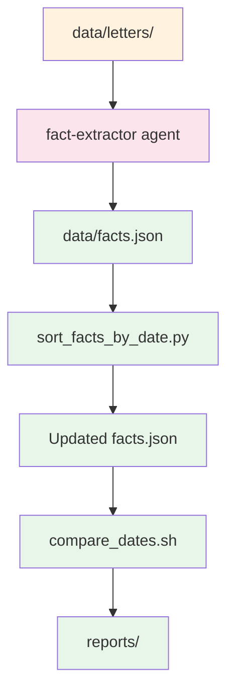

# Rosenberg Research Process Architecture

## Overview
The Rosenberg research process is a comprehensive system for transforming historical German genealogical documents into structured facts. It maintains a structured JSON database of historical relationships extracted from letters. The letters themselves are synced from Google Docs (the primary knowledge base) by a separate pipeline — see [`sync_from_google/architecture.md`](../sync_from_google/architecture.md) for that.

## System Components

### Document Processing Pipeline
- **process_document.sh**: Extracts facts from a specific letter/document file

### Data Management
- **facts_verify_json.sh**: Validates JSON structure and chronological ordering
- **sort_facts_by_date.py**: Sorts facts.json chronologically
- **merge_facts.py**: Merges new facts into facts.json with automatic sorting
- **print_facts_by_date.sh**: Prints facts matching a specific date
- **remove_facts_by_date.sh**: Removes facts matching a specific date

### Data Validation & Reporting
- **compare_dates.sh**: Generates comparison reports between facts.json and letter files
- **print_fact_dates.sh**: Extracts dates from facts.json
- **print_letter_dates.sh**: Extracts dates from letter filenames
- **convert_date_to_iso.sh**: Converts letter dates to ISO format

### Automated Workflows
- **process_next_letter.sh**: Automates processing of next unprocessed letter
- **get_next_letter.sh**: Gets information about next letter to process
- **remove_letter_from_report.sh**: Removes processed letters from report

## Data Flow Architecture

### Source to Fact Pipeline
`data/letters/` is populated by the sync pipeline documented in
[`sync_from_google/architecture.md`](../sync_from_google/architecture.md). From there:

### Key Data Structures
- **data/books/sections/**: Bilingual documents with German/English columns
- **data/books/original/**: German-only versions of documents
- **data/books/english/**: English-only versions of documents
- **data/letters/**: Individual historical letters split by date
- **data/facts.json**: Structured database of historical facts
- **reports/**: Validation reports showing date comparisons

## Agent Integrations

### Fact Extraction Agents
- **fact-extractor**: Processes individual letters to extract genealogical facts
- **fact-syntax-verifier**: Validates fact extraction syntax and structure
- **fact-source-verifier**: Verifies source citations in extracted facts
- **fact-irrelevant-verifier**: Identifies and filters out irrelevant facts

### Workflow Agents
- **process-next-letter**: Automates the processing of the next unprocessed letter
- **process-document**: Handles specific document processing requests

## Workflow Patterns

### Automated Processing Workflow
1. `/process-next-letter` slash command triggers `process_next_letter.sh`
2. System identifies next unprocessed letter from `reports/dates_only_in_letters.md`
3. Letter details are displayed for agent processing
4. `fact-extractor` agent processes the letter
5. `fact-syntax-verifier` validates the extracted facts
6. Processed letter is removed from the report
7. Progress is reported to the user

### Manual Processing Workflow
1. `/process-document <filename>` slash command triggers `process_document.sh`
2. Document details are displayed for agent processing
3. `fact-extractor` agent processes the letter
4. `fact-source-verifier` and `fact-irrelevant-verifier` validate facts
5. Existing facts for the date are retrieved and merged
6. Old facts are removed and new facts are merged
7. `fact-syntax-verifier` validates the updated facts
8. Progress is reported to the user (no report modification)

## Security & Data Integrity

### Data Validation
- All dates in facts.json must be sortable (YYYY or YYYY-MM-DD)
- Every fact entry requires valid source reference
- Relationship clarity: avoid ambiguous pronouns; use full names
- Name variations: consult `data/variations.md` for historical spellings
- No hallucinations: never infer facts not explicitly stated in sources

## Script Implementation Details

### Data Validation Tools
- `compare_dates.sh`: Cross-references dates, generates reports in `reports/`
- `facts_verify_json.sh`: Validates JSON syntax and chronological ordering
- `convert_date_to_iso.sh`: Handles various date formats including ranges
- Helper scripts: `print_fact_dates.sh`, `print_letter_dates.sh`, `extract_letter_source.sh`