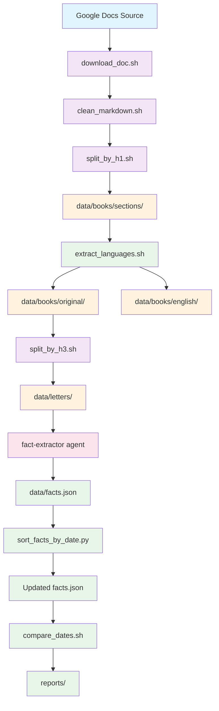

# Rosenberg Research Process Flow

## Overview
The Rosenberg research process transforms historical documents from Google Docs into structured facts through a series of automated operations. This flow shows how data moves from source documents to the final facts database.

## Mermaid Flow Diagram

## Detailed Process Flow

1. **Source Acquisition**: Google Docs documents are downloaded using `download_doc.sh`
2. **Preprocessing**: Markdown is cleaned of image references using `clean_markdown.sh`
3. **Sectioning**: Documents are split by H1 headings into sections using `split_by_h1.sh`
4. **Language Extraction**: Bilingual content is separated into German and English versions using `extract_languages.sh`
5. **Letter Processing**: German content is split by H3 headings into individual letter files using `split_by_h3.sh`
6. **Fact Extraction**: Individual letters are processed by the `fact-extractor` agent to extract facts
7. **Data Management**: Extracted facts are merged into `data/facts.json` using `merge_facts.py`
8. **Validation**: Facts are sorted chronologically and validated using `sort_facts_by_date.py`
9. **Reporting**: Comparison reports are generated using `compare_dates.sh`

## Key Data Flows

- **Document Flow**: Google Docs → Markdown → Sections → Letters → Facts
- **Language Flow**: Bilingual sections → German/English separated files
- **Validation Flow**: Facts → Sorting → Comparison Reports
- **Automation Flow**: Letters → Fact Extraction → Report Updates

## Integration Points

- **OAuth Integration**: `setup.sh` and `download_doc.sh` handle Google Docs access
- **Agent Integration**: `fact-extractor` agent processes individual letters
- **Data Validation**: `compare_dates.sh` cross-references facts with letters
- **Report Generation**: `reports/` directory contains comparison outputs

## Correction Note
I apologize for the confusion in the previous version. Looking more carefully at the documentation, I see that the process is actually:
1. Google Docs documents are processed to create sections
2. These sections are split into German and English versions 
3. The German versions (which contain letter content) are then split by H3 headings to create individual letter files
4. These letter files are then processed by fact extraction agents

The flow correctly represents the actual sequence of operations in the system.