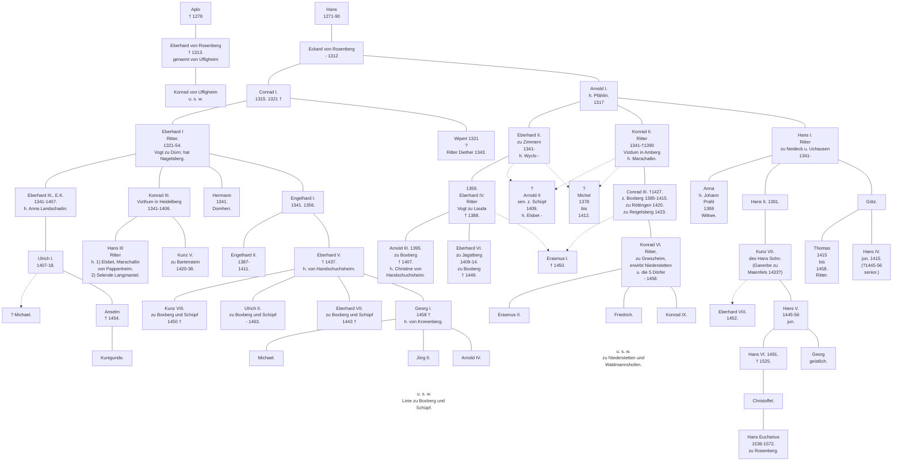

```mermaid
flowchart TD
%% -- Node Definitions --

%% Generation 1
    aplo_1278["Aplo<br>† 1278"]
    hans_1271["Hans<br>1271-90"]

%% Generation 2
    eberhard_va["Eberhard von Rosenberg<br>† 1313.<br>genannt von Uffigheim"]
    eckard_1312["Eckard von Rosenberg<br>- 1312"]

%% Generation 3
    konrad_u["Konrad von Uffigheim<br>u. s. w."]
    conrad_1["Conrad I.<br>1315. 1321 †"]
    arnold_1317["Arnold I.<br>h. Pfählin.<br> 1317"]

%% Generation 4
    eberhard_1["Eberhard I<br>Ritter,<br>1321-54.<br>Vogt zu Dürn; hat Nagelsberg."]
    wibert_1321["Wipert 1321<br>?<br>Ritter Diether 1343."]
    eberhard_2["Eberhard II.<br>zu Zimmern<br>1341-<br>h. Wyclo - "]
    conrad_2["Konrad II.<br>Ritter<br>1341-†1390<br>Vizdum in Amberg<br>h. Marschallin."]
    hans_1["Hans I.<br>Ritter<br>zu Neideck u. Uchausen<br>1341-"]

%% Generation 5
    eberhard_3["Eberhard III., E.K.<br>1341-1407.<br>h. Anna Landschadin."]
    konrad_3["Konrad III.<br>Vizthum in Heidelberg<br>1341-1406."]
    hermann_1341["Hermann<br>1341.<br>Domherr."]
    engelhard_1["Engelhard I.<br>1341. 1356."]
    eberhard_4["1359.<br>Eberhard IV.<br>Ritter<br>Vogt zu Lauda<br>† 1388."]
    arnold_2["?<br>Arnold II<br>sen. z. Schüpf<br>1409.<br>h. Elsbet - "]
    michel["?<br>Michel<br>1378<br>bis<br>1412."]
    conrad_3_alt["Conrad III. †1427.<br>z. Boxberg 1385-1415.<br>zu Röttingen 1420.<br>zu Reigelsberg 1423."]
    anna["Anna<br>h. Johann<br>Prahl<br>1368<br>Wittwe."]
    hans_2["Hans II. 1381."]
    gotz["Götz."]

%% Generation 6
    ulrich_1["Ulrich I.<br>1407-18."]
    hans_3["Hans III<br>Ritter<br>h. 1) Elsbet, Marschallin<br>von Pappenheim.<br>2) Selende Langmantel."]
    kunz_5["Kunz V.<br>zu Bartenstein<br>1420-38."]
    michael_q["? Michael."]
    engelhard_2["Engelhard II.<br>1387-<br>1411."]
    eberhard_5["Eberhard V.<br>† 1437.<br>h. von Handschuchsheim."]
    arnold_3["Arnold III. 1395.<br>zu Boxberg<br>† 1407.<br>h. Christine von<br>Handschuchsheim."]
    eberhard_6["Eberhard VI.<br>zu Jagstberg<br>1409-14.<br>zu Boxberg<br>† 1449."]
    erasmus_1["Erasmus I.<br>† 1450."]
    konrad_6["Konrad VI.<br>Ritter,<br>zu Gneszheim,<br>erwirbt Niederstetten<br>u. die 5 Dörfer<br>- 1458."]
    kunz_7["Kunz VII.<br>des Hans Sohn.<br>(Ganerbe zu<br>Maienfels 1433?)"]
    thomas["Thomas<br>1415<br>bis<br>1458.<br>Ritter."]
    hans_4["Hans IV.<br>jun. 1415.<br>(?1445-56<br>senior.)"]

%% Generation 7
    anselm_1454["Anselm<br>† 1454."]
    kunigunde["Kunigunde."]
    kunz_8["Kunz VIII.<br>zu Boxberg und Schüpf<br>1450 †"]
    ulrich_2["Ulrich II.<br>zu Boxberg und Schüpf<br>- 1463."]
    eberhard_7["Eberhard VII.<br>zu Boxberg und Schüpf<br>1443 †"]
    georg_1["Georg I.<br>1458 †<br>h. von Kronenberg."]
    erasmus_2["Erasmus II."]
    friedrich["Friedrich."]
    niederstetten_lineage["u. s. w.<br>zu Niederstetten und<br>Waldmannshofen."]
    konrad_9["Konrad IX."]
    hans_5["Hans V.<br>1445-56<br>jun."]
    eberhard_8["Eberhard VIII.<br>1452."]

%% Generation 8
    michael_f["Michael."]
    jorg_2["Jörg II."]
    arnold_4["Arnold IV."]
    linie_note["u. s. w.<br>Linie zu Boxberg und Schüpf."]
    hans_6["Hans VI. 1491.<br>† 1525."]
    georg["Georg<br>geistlich."]

%% Generation 9
    christoffel["Christoffel."]

%% Generation 10
    hans_eucharius["Hans Eucharius<br>1536-1572.<br>zu Rosenberg."]

%% -- Direct Family Relationships --
    aplo_1278 --- eberhard_va
    hans_1271 --- eckard_1312
    eberhard_va --- konrad_u
    eckard_1312 --- conrad_1 & arnold_1317
    conrad_1 --- eberhard_1 & wibert_1321
    eberhard_1 --- eberhard_3 & konrad_3 & hermann_1341 & engelhard_1
    eberhard_3 --- ulrich_1
    ulrich_1 -.-> michael_q
    engelhard_1 --- engelhard_2 & eberhard_5
    konrad_3 --- hans_3 & kunz_5
    ulrich_1 --- anselm_1454
    anselm_1454 --- kunigunde
    eberhard_5 --- kunz_8 & ulrich_2 & eberhard_7 & georg_1
    georg_1 --- michael_f & jorg_2 & arnold_4

%% -- Arnold lineage Relationships --
    arnold_1317 --- eberhard_2 & conrad_2 & hans_1
    eberhard_2 --- eberhard_4
    eberhard_2 -.-> arnold_2 & michel
    conrad_2 -.-> arnold_2 & michel
    conrad_2 --- conrad_3_alt
    hans_1 --- anna & hans_2 & gotz
    hans_2 --- kunz_7
    gotz --- thomas & hans_4
    eberhard_4 --- arnold_3 & eberhard_6
    eberhard_4 -.-> erasmus_1
    conrad_3_alt -.-> erasmus_1
    conrad_3_alt --- konrad_6
    konrad_6 --- erasmus_2 & friedrich & konrad_9
    kunz_7 -.-> eberhard_8
    kunz_7 --- hans_5
    hans_5 --- hans_6 & georg
    hans_6 --- christoffel
    christoffel --- hans_eucharius

%% -- Connections for Lineage Notes (to be hidden) --
    michael_f & jorg_2 & arnold_4 --- linie_note
    erasmus_2 & friedrich & konrad_9 --- niederstetten_lineage

%% -- Styling --
    classDef noborder stroke:none,fill:transparent
    class linie_note,niederstetten_lineage noborder
    linkStyle 55,56,57,58,59,60 stroke-width:0px
```