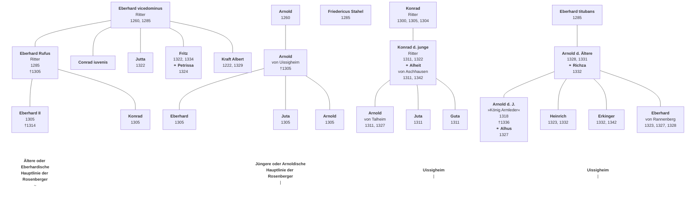

```mermaid
flowchart TD
%% -- Node Definitions --

%% Generation 1
    p1_eberhard_v["<b>Eberhard vicedominus</b><br>Ritter<br>1260, 1285"]
    p1_arnold_1260["<b>Arnold</b><br>1260"]
    p1_friedericus["<b>Friedericus Stahel</b><br>1285"]
    p1_konrad_1300["<b>Konrad</b><br>Ritter<br>1300, 1305, 1304"]
    p1_eberhard_t["<b>Eberhard titubans</b><br>1285"]

%% Generation 2
    p2_eberhard_r["<b>Eberhard Rufus</b><br>Ritter<br>1285<br>†1305"]
    p2_conrad_i["<b>Conrad iuvenis</b>"]
    p2_jutta["<b>Jutta</b><br>1322"]
    p2_fritz_family["<b>Fritz</b><br>1322, 1334<br>⚭ <b>Petrissa</b><br>1324"]
    p2_kraft_albert["<b>Kraft Albert</b><br>1222, 1329"]
    p2_arnold_u["<b>Arnold</b><br>von Uissigheim<br>†1305"]
    p2_konrad_j_family["<b>Konrad d. junge</b><br>Ritter<br>1311, 1322<br>⚭ <b>Alheit</b><br>von Aschhausen<br>1311, 1342"]
    p2_arnold_a_family["<b>Arnold d. Ältere</b><br>1328, 1331<br>⚭ <b>Richza</b><br>1332"]

%% Generation 3
    p3_eberhard_2["<b>Eberhard II</b><br>1305<br>†1314"]
    p3_konrad_1305["<b>Konrad</b><br>1305"]
    p3_eberhard_1305["<b>Eberhard</b><br>1305"]
    p3_juta_1305["<b>Juta</b><br>1305"]
    p3_arnold_1305["<b>Arnold</b><br>1305"]
    p3_arnold_t["<b>Arnold</b><br>von Talheim<br>1311, 1327"]
    p3_juta_1311["<b>Juta</b><br>1311"]
    p3_guta["<b>Guta</b><br>1311"]
    p3_arnold_j_family["<b>Arnold d. J.</b><br>»König Armleder«<br>1318<br>†1336<br>⚭ <b>Alhus</b><br>1327"]
    p3_heinrich["<b>Heinrich</b><br>1323, 1332"]
    p3_erkinger["<b>Erkinger</b><br>1332, 1342"]
    p3_eberhard_rann["<b>Eberhard</b><br>von Rannenberg<br>1323, 1327, 1328"]

%% Lineage Descriptions
    line_aeltere["<b>Ältere oder Eberhardische<br>Hauptlinie der Rosenberger</b><br>~"]
    line_juengere["<b>Jüngere oder Arnoldische<br>Hauptlinie der Rosenberger</b><br>|"]
    uissigheim_1["<b>Uissigheim</b><br>|"]
    uissigheim_2["<b>Uissigheim</b><br>|"]

%% -- Connections --

%% Parent-to-child connections
    p1_eberhard_v --- p2_eberhard_r & p2_conrad_i & p2_jutta & p2_fritz_family & p2_kraft_albert
    p1_arnold_1260 --- p2_arnold_u
    p1_konrad_1300 --- p2_konrad_j_family
    p1_eberhard_t --- p2_arnold_a_family

    p2_eberhard_r --- p3_eberhard_2 & p3_konrad_1305
    p2_arnold_u --- p3_eberhard_1305 & p3_juta_1305 & p3_arnold_1305
    p2_konrad_j_family --- p3_arnold_t & p3_juta_1311 & p3_guta
    p2_arnold_a_family --- p3_arnold_j_family & p3_heinrich & p3_erkinger & p3_eberhard_rann

%% Children to Lineage connections
    p3_eberhard_2 & p3_konrad_1305 --- line_aeltere
    p3_eberhard_1305 & p3_juta_1305 & p3_arnold_1305 --- line_juengere
    p3_arnold_t & p3_juta_1311 & p3_guta --- uissigheim_1
    p3_arnold_j_family & p3_heinrich & p3_erkinger & p3_eberhard_rann --- uissigheim_2

%% -- Styling --
    classDef noborder stroke:none,fill:transparent
    class line_aeltere,line_juengere,uissigheim_1,uissigheim_2 noborder
    linkStyle 20,21,22,23,24,25,26,27,28,29,30,31 stroke-width:0px
```
