# Neumaier [1986]

## **Die Herren von Rosenberg**

Bemerkungen zur frühen Geschichte einer fränkischen Niederadelsfamilie  
von HELMUT NEUMAIER

Oft und viel mußten unsere Untersuchungen die heutigen Grenzen überschreiten und Material suchen aus Baden und Bayern; da und dort hofften wir auch für unsere Nachbarn etwas Brauchbares beigebracht zu haben. Gewöhnlich hat sich das ganz zufällig gemacht, heute aber gehen wir mit aller Absicht darauf aus, jenem ersten Namen unseres Vereins (Anm. \>Historischer Verein für das fränkische Wirtemberg und seine Grenzen\<) seine gebührende Ehre anzuthun, und suchen einen Stoff, welcher für unser wirtemb. Franken und seine beiden Nachbarländer gleiches Interesse hat; welcher diesseits und jenseits der Grenzen die Provincial- oder Lokalgeschichte zu fördern im Stande ist. Bei diesem Suchen bietet sich uns bald das reichbegüterte Geschlecht der Herren von Rosenberg dar, welche im heutigen Baden und Bayern ebenso, wie in unserem Wirtemberg eine Reihe von Burgen und Rittergütern besessen haben und in der Provincialgeschichte keine ganz unbedeutende Rolle spielen.

Daß Hermann *Bauer* zitiert wird1, soll als Würdigung eines Historikers verstanden werden, dem thematisch die Erforschung des Nieder- oder Ritteradels Anliegen war, der sich methodisch durch Landesgrenzen \- es gab noch lange eine badische, bayerische usw. Staatsangehörigkeit\! \- nicht beirren ließ. Es liegt in der Natur der Sache, daß sich seit seiner 1872 erschienenen Studie zu den Rosenbergern die Fragestellung gewandelt hat. Der genealogische und prosopographische Ansatz machte der Klärung von grundsätzlichen Fragen der Sozialstruktur und der Auswirkungen sozialen Wandels Platz². In mancherlei Hinsicht beschäftigen uns aber immer noch dieselben Probleme, die schon H. *Bauer* aufgeworfen hat. Die Genealogie ist nicht das geringste darunter. Jede Untersuchung zur frühen Geschichte einer Niederadelsfamilie muß von dem Bewußtsein begleitet sein, daß sich deren Formierung in einem Zeitraum gering verbreiteter Schriftlichkeit vollzog³, innerhalb dessen die Edel- oder Hochfreien4 einigermaßen spät, der Ministerialenadel nochmals später sich der schriftlichen Form beim Abschluß von Rechtsgeschäften bediente. Ähnlich zeitversetzt verlief der Übergang von der Einnamigkeit zum Geschlechternamen5, wenn auch mit erheblichen Abweichungen innerhalb ein und derselben Schicht. Ein frühes Beispiel für die Ministerialität sind die Boxbergischen Dienstleute Berthold und Hartmann von Schweigern vor 1120 im Komburger Traditionsbuch6. Dieses Phänomen ist die zweite Voraussetzung dafür, daß beide Adelsschichten überhaupt faßbar werden. Erst seit der zweiten Hälfte des 13. Jahrhunderts weisen Niederadlige als Familie deutliche Konturen auf. Am Beispiel der im Umkreis der Rosenberger bestuntersuchten Familie, der Rüdt von Collenberg und Bödigheim, konnte es jüngst wieder demonstriert werden7. 1 *Hermann Bauer:* Die Herren von Rosenberg. In: WFr9/2 (1872) S. 177-221, hier S. 177f. 2 *Roger Sablonier:* Adel im Wandel. Eine Untersuchung zur sozialen Situation des ostschweizerischen Adels um 1300 (Veröffentlichungen des Max-Planck-Instituts für Geschichte Bd. 66. 1966). S. 9. 3 *Peter Johanek:* Die Frühzeit der Siegelurkunde im Bistum Würzburg (Quellen und Forschungen zur Geschichte des Bistums und Hochstifts Würzburg Bd. 30, 1969). 4 Zur Adelsschichtung vgl. *Michael Mitterauer*: Probleme der Stratifikation in mittelalterlichen Gesellschaftssystemen. In: *Jürgen Kocka* (Hg): Theorien in der Praxis des Historikers (Geschichte und Gesellschaft. Sonderheft 3, 1977). S. 13-54. 5 *Karl Schmid:* Zur Problematik von Familie, Sippe und Geschlecht. Haus und Dynastie beim mittelalterlichen Adel. In: ZGO 105 (1957) S. 1-62. Ders.: Heirat, Familienfolge, Geschlechterbewußtsein. In: Settimane di Studio del Centro Italiano 24 (1977). S. 103-137. 6 WUB 1 Nr. 21, S. 405. 7 *Gabriele Enders:* Die Abtei Amorbach und ihre Beziehungen zu der niederadeligen Familie Rüdt von Collenberg. In: *Friedrich Oswald-Wilhelm Störmer* (Hg.): Die Abtei Amorbach im Odenwald. 1984. S. 167-168. Würzburger Dissertation der Verf. zu den Rüdt in Vorbereitung.

Man muß sich auf vergleichsweise bescheidene Fragen beschränken: Wann und in welchem herrschaftlichen Umfeld sind die Rosenberger erstmals nachzuweisen? Wie sah ihre Besitzbasis aus? Auf welche Weise vollzog sich ihr Ausgreifen über den Stammsitz hinaus? Unschwer sind dahinter Probleme gewichtigerer Art auszumachen: Welche Voraussetzungen befähigten sie zum Aufstieg in die Spitzengruppe8 des Niederadels? Warum gelang er ihnen und nicht anderen Familien innerhalb einer, wenn man das Konnubium zugrundelegt, soziologisch homogenen Schicht? Welche Möglichkeiten boten die politischen Strukturen Frankens einem solchen Aufstieg bzw. vermochten ihn zu hemmen? Inwieweit kommt persönlichen Fähigkeiten eine Bedeutung zu? Die thematische Begrenzung auf ein einziges Adelshaus darf nicht dazu verleiten, Antworten zu erwarten (genauer: zu erzwingen). Das Beispiel der Rosenberger kann nur als ein Beitrag zu Versuchen zur Klärung der angesprochenen Fragen bewertet werden.  8 Begriff nach R. *Sablonier* (wie Anm. 2) S. 112.

Wieder möge Hermann *Bauer* zu Wort kommen9: \>\>Bedenken wir, daß die Herren von Ussigheim ein und dasselbe Wappen führten, wie die Herren von Rosenberg, so unterliegt es wohl keinem Zweifel dieser Eberhard (Anm. der im Bronnbacher Nekrolog als 1314 verstorben verzeichnete Träger dieses Namens; in der Stammtafel Eberhard II.) hat eine besondere Linie auf der Burg in Ussigheim begründet und die folgenden Herren von Ussigheim gehören auch zum Rosenberger Stammbaum im weiteren Sinn\<\<. 9 *H. Bauer* (wie Anm. 1) S. 179.

Die Herkunftsfrage schien damit gelöst. Die Rosenberger führen den Namen nach dem wenige Kilometer östlich von Osterburken gelegenen Dorf, und demnach mußte dort ihr Stammsitz zu suchen sein. Nun ist bekannt, daß bei den meisten Adelsfamilien der Geschlechtername fixiert bleibt, es von dieser Namenskonstanz aber durchaus Abweichungen gibt. Walther *Möller10* hat gegen *Bauer* eingewandt, daß nicht die Uissigheimer aus dem Rosenbergischen Stamm hervorgingen, vielmehr der umgekehrte Tatbestand gegeben sei. Auf der Grundlage etwas breiteren Quellenmaterials, als es beiden Forschern zur Verfügung stand, bestätigt sich *Möllers* These.  10 *Walther Möller:* Stamm-Tafeln westdeutscher Adels-Geschlechter im Mittelalter Bd. 2. 1933. S. 188.

Bemerkenswert ist die Wappenähnlichkeit11: Uissigheim fünfmal gespaltener und einmal geteilter Schild in Silber und Rot, als Helmzier zwei Schwanenhälse, der rechte silbern, der linke rot; Rosenberg mit vertauschter Reihenfolge der Farben, in der Helmzier noch eine rote Rose zwischen die Schwanenhälse gesetzt. Eine solche Brisur ist ein nicht zu übersehender Hinweis für die Unterscheidung einer Seiten- von der Hauptlinie12. 11 *Alfred F. Wolfert:* Wappengruppen des Adels im Odenwald-Spessart-Raum. In: Beiträge zur Erforschung des Odenwaldes und seiner Randlandschaften 2. 1977. S. 325-406; hier: S. 378f. 12 Wappenfibel. Handbuch der Heraldik. Hg. Herold Verein für Heraldik, Genealogie und verwandte Wissenschaften. 161970. S. 146.

Ein Indiz für die Zusammengehörigkeit mag auch in der Grablege gesehen werden. Uissigheimer wie Rosenberger, diese bis in die erste Hälfte des 14. Jahrhunderts, fanden im Kloster Bronnbach ihre letzte Ruhestätte13, obwohl sich das von Burg und Dorf Rosenberg weit weniger entfernt gelegene Schöntal doch eher angeboten hätte. Das sind zugegebenermaßen nicht mehr als Hinweise, doch drei weitere Tatbestände sind besonders ernstzunehmen: beider Besitz in und um Uissigheim \- noch 1381 waren die Rosenberger dort begütert, bis zu ihrem Erlöschen im Jahre 1632 hatten sie den Pfarrpatronat inne14\-, die Häufigkeit gemeinsamen Auftretens in Urkunden, vor allem die Kombination der Namen wie de *Rosinberg dictus de Ussinkeim*. Das Bewußtsein gleicher Abstammung ist noch lange lebendig geblieben. Um ein Beispiel anzuführen: Ritter Arnold der Junge von Uissigheim wurde von Graf Rudolf IV. von Wertheim auf zehn Jahre des Landes verwiesen. In der betreffenden Urkunde vom 24. November 133215 werden Ritter Arnold der Ältere, seine Söhne Heinrich und Eberhard sowie Konrad, alle von Uissigheim, aber auch Wipert, Eberhard und Arnold von Rosenberg aufgeführt.  13 Belege bei *Johannes Kühles:* Liber mortuorum monasterii Brunnbacensi. In: Archiv des Historischen Vereins von Unterfranken und Aschaffenburg 21 (1871). S. 91-159. 14 GLA Abt. 229/56 885. 15 StA Wertheim GXIII 124; dazu *Klaus Arnold:* Die Armledererhebung in Franken. In: Mainfränkisches Jahrbuch 26 (1974). S. 35-62, hier: S. 60 ff.

Die Translozierung aus dem Taubergebiet ins Bauland kann zweifellos mehr Wahrscheinlichkeit für sich in Anspruch nehmen als die Annahme des umgekehrten Ablaufs. Dafür gibt es ein zusätzliches Argument. Etwa 12km westlich von Dorf Rosenberg liegt die Zisterze Seligental, Gründung des Edelfreien Konrad von Dürn (1236). Aufgrund der recht dichten urkundlichen Überlieferung des Frauenklosters kennt man den Ministerialenadel in dessen Umkreis recht gut16. Den Namen eines sich nach Uissigheim-Rosenberg nennenden Geschlechts sucht man vergebens. 16 *Valentin Ferdinand von Gudenus:* Codex Diplomaticus sive anecdota res Moguntinas... illustrantia vol. III. Göttingen-Frankfurt-Leipzig 1751

Kann dieses Problem als gelöst gelten, so bereitet ein anderes größere Schwierigkei- ten. Es besteht in der Zuweisung an eine bestimmte Schicht des Adels. In der Bestätigung eines Gütertausches zwischen Graf Boppo I. von Wertheim und Bronnbach 1178 erscheinen in der Zeugenliste *Arnoldus und Conradus, duo filii Ruperti de Ussincheim*17. Da ferner unter den Zeugen dienstmannschaftliches Standes ein Herbordus de Ussencheim vorkommt, gehören die Erstgenannten zu den Edelfreien. Andere Erwähnungen besagen dasselbe18: 1219 *Arnoldus liber* und 1233 *Arnoldus vir nobilis*, 1244 *Conradus liber*, 1247 *Eberhardus* et *Arnoldus* *fratres*, Söhne des *nobilis* von Uissigheim. Als die Grafen von Rieneck am 21. Juli 1260 vom Erzstift Mainz zur Aufgabe ihres Anspruchs, im Spessart Burgen zu errichten, gezwungen wurden19, enthält die Zeugenreihe die Namen bekannter Edelfreier wie Boppo, Rupert und Ulrich von Dürn, Kraft von Boxberg. Deutlich von ihnen abgesetzt, u. a. durch den würzburgischen Ministerialen Theodoricus Blumelin, erschienen *Eberhardus* und *Arnoldus fratres de Ussenkeim*.  17 *Joseph Aschbach:* Geschichte der Grafen von Wertheim. 1853. Nr. 15, S. 25. 18 StA Wertheim Lit. 436 Bronnbacher Kopialbuch fol. 52 seq. (1219), fol. 115 (1233), 115 (1244), fol. 33 ; weitere Belege bei *Helmut Lauf-Otto Uihlein*: Uissigheim im Spiegel seiner 1200jährigen Geschichte. 1966. S. 28 ff., wo nicht zwischen Liberi und Dienstmannen unterschieden wird. 19 *V.F. von Gudenus:* Codex vol. 1. Göttingen 1743. Nr. 295, p. 674. Theodor Ruf: Die Grafen von Rieneck. Genealogie und Territorienbildung (Mainfränkische Studien 32, 1984) Teil I. S. 152f.

Die Standesbezeichnungen *liber, vir nobilis* können sich nur auf Edel- oder Hochfreie beziehen, unmöglich Dienstmannen bezeichnen. Die Uissigheimer, die die Urkunde von 1260 bezeugen, gehören unzweifelhaft dem Niederadel an. Damit ist das gelegentlich beschworene Problem der Entfreiung aufgeworfen. Man versteht darunter die Standesminderung, die sich aus der Heirat einer Edelfreien und eines Angehörigen des niederen Adels ergab20. Im Falle der Uissigheimer ist das nicht von vornherein auszuschließen, da vor allem in den Vornamen eine auffällige Kontinuität besteht21. 20 Dazu *R. Sablonier* (wie Anm. 2 S. 41 ff. 21 Auch W. *Möller*, Stamm-Tafeln (wie Anm. 10) S. 189 zieht aufgrund der Vornamen Edelfreie und Niederadlige zusammen.

In diesem Zusammenhang ist an die Beobachtung zu erinnern, daß Ministerialenfamilien sich nicht selten nach ihren Herren nennen (Bekanntes Beispiel in unserem Raum sind die Dürn als Dienstmannen der gleichnamigen Edelfreien); das kann sogar bis zu den Vornamen gehen. Das ist noch kein Beweis gegen eine Familienidentität. Es gibt m. E. jedoch im Fränkischen nicht ein einziges gesichertes Beispiel für eine Entfreiung²². Dafür kennt man zur Genüge Zeugnisse, daß Edelfreie trotz desolater wirtschaftlicher Lage innerhalb des Standes heirateten oder Konnubium mit gräflichen Häusern besteht23. 22 Für die Thüngen nimmt es *Rudolf Karl Reinhard Frh. von Thüngen:* Zur Genealogie der Familie derer von Thüngen. In: Archiv... Unterfranken und Aschaffenburg 54 (1912) S. 1-180, hier: S. 9f. an. 23 Als Beispiel sei die Verbindung der Grafen von Wertheim und der Edelfreien von Boxberg genannt; vgl. *J. Aschbach* (wie Anm. 17) Bd. 2, S. 105 ff.

Man muß folglich davon ausgehen, daß eine Edelfreien- und eine Niederadelsfamilie, die sich beide nach Uissigheim nannten, zu unterscheiden sind. Von den nobiles verliert sich nach 1247 jede Spur, so daß man von ihrem Erlöschen ausgehen darf. Obwohl es keinen Beleg für einen Zusammenhang mit den Wertheimern gibt, könnte eine Verwandtschaftsverbindung zu diesem Grafenhaus bestanden haben. Wertheimischer Besitz findet sich nämlich in auffälliger Häufung im unmittelbaren Umkreis von Uissigheim.

Mehr Schwierigkeiten bereitet die Frage, wann und weshalb sich die Niederadligen in zwei Hauptstränge aufspalteten. Der Uissigheimer erlosch 1546 mit Martin, der Rosenberger 1632 mit Albrecht Christoph. Wir haben 1260 Eberhard und Arnold von Uissigheim kennengelernt, und 1285 nannte sich Eberhard Rufus (der Rote) nach Rosenberg. In diesem Zeitraum muß die Verselbständigung der beiden Familienstränge ihren Anfang genommen haben.

Zunächst sei der Quellenbefund vorgestellt. Am 14. Januar 1285 verkaufte Graf Rudolf II. von Wertheim an Kloster Bronnbach vier Höfe zu Kirschfurt24. Den Rechtsvorgang bezeugten *Eberhardus Rufus de Ussenkeim* und sein Bruder *Conradus iuvenis* (der Jüngere), sodann *Eberhardus vicedominus de Ussenkeim* und dessen Bruder *Fridericus Stahel*. In eben diesem Jahre veräußerte der Graf dem Kloster eine zu Reicholzheim gelegene Mühle25. Dabei werden *Eberhardus Rufus de Rosenberg* und *Conradus iuvenis* sowie die Brüder *Eberhardus quondam vicedominus* und *Fridericus Stahel* genannt, die beiden Letzteren als *milites de Ussinkeim*. Bei dem einmal nach Rosenberg und einmal nach Uissigheim bezeichnenden Eberhard Rufus ist folglich Personengleichheit gegeben. Ferner liegt auf der Hand, daß 1285 der Besitz im Bauland schon erworben war. Drei Jahre später entschied Abt Wintherus von Bronnbach einen Streit über Wiesen zu Hemsbach zwischen Seligental und *Eberhardus miles de Rosinberg dictus de Ussinkeim*26. 24 StA Wertheim Lit. A 436 Bronnbacher Kopialbuch fol. 115. 25 V. F. v. Gudenus, Codex (wie Anm. 16) vol. I Nr. 384, p. 815 seq. 26 Ebd., Nr. 382, p. 812 seq.

In der Beurkundung einer Güterübergabe erscheinen 1285 *Eberhardus Titubans de Ussynkeim et Arnoldus filius eiusdem*27. Heranzuziehen ist auch eine Urkunde vom 17. Mai 1300, in der Eberhard und Konrad, die Söhne eines (schon verstorbenen) Ritters Eberhard genannt von Rosenberg vorkommen28. Als *nepotes* des Ritters treten hier Arnold, Juta und ein weiterer Eberhard auf. Eine Urkunde vom 25. Oktober 1305 über den Verkauf von Gütern in Steinbach an Bronnbach vermag einiges zu ergänzen29. Handelnde waren *Eberhardus maior* (der Ältere) und *Conradus frater suus dictus de Rosinberg*, die ausdrücklich als Söhne des *Eberhardus Rufus* bezeichnet sind; erwähnt werden außerdem *Eberhardus minor* und *Arnoldus*, Gebrüder und Söhne Arnolds genannt von Uissigheim.  27 Wie Anm. 25. 28 StA Wertheim R US 1300 Mai 17. 29 StA Wertheim R US 1305 Oktober 25.

Mit diesen Quellenbelegen läßt sich ein einigermaßen haltbarer genealogischer Zusammenhang herstellen. Das ändert nichts an der weisen Einsicht, die H. *Bauer* einst seinem Entwurf voranstellte, daß unser jetziger Stammbaum... jedenfalls relativ der genügendere ist30. Eberhardus Rufus hatte zwei Söhne. Da ist zum einen *Eberhardus* II. *miles*, der 1305 und 1314 als *maior* näher bezeichnet wird³¹, folglich gab es damals noch einen jüngeren Eberhard32. Der Ältere dürfte mit dem im Bronnbacher Nekrolog als 1314 verstorben genannten Träger dieses Namens identisch sein33. Der zweite Sohn des Eberhardus Rufus war Konrad II., der von 1305 bis 1321 vorkommt. Als seine Gattin ist Adelheid von Neudeck bekannt; 1327 schon Witwe, hinterließ sie einen minderjährigen Sohn34. Dieser Edelknecht Hans begegnet 1340 bis 1359. Da er 1355 den Zusatz von Neudeck führt35, kann er von dem gleichnamigen Ritter Hans III. (I.) sicher unterschieden werden. Nachkommen sind nicht zuzuweisen, so daß mit ihm die Erste oder Eberhardische Hauptlinie erlosch.  30 H. Bauer (wie Anm. 1) S. 178. 31 W. Möller (wie Anm. 10) setzt Eberhard I. und II. gleich: im Folgenden wird seine Zählung in Klammern beigegeben. 32 StA Wertheim Lit. A 436 fol. 94. 33 J. Kühles (wie Anm. 13) S. 128. 34 StA Wertheim Lit. A 436 fol. 94 35 StA Ludwigsburg Bü 302 Nr. 95; nicht bei Walther Ludwig: Das Geschlecht der Herren von Neideck bis um 1500, In: WFr 68 (1984) S. 63-96.

Die Besitzverhältnisse sind das zu bestätigen geeignet. Das durch Bischof Andreas von Gundelfingen (1303-1313) angelegte älteste Lehenbuch des Hochstifts Würzburg verzeichnet die von ihm ausgegebenen Besitzungen im Umkreis von Dorf Rosenberg. Die erste diesbezügliche Notiz36 betrifft die Belehnung des Eberhard II. mit der Hälfte des Dorfes Bofsheim. Da in der Folgezeit nur Angehörige der anderen Hauptlinie als Inhaber des ganzen Dorfes erwähnt werden37, verdichtet sich die Vermutung zur Gewißheit, daß sie zunächst die andere Hälfte des Ortes vom Hochstift zu Lehen trug, nach dem Tode Eberhards II. 1314 dann das ganze Dorf. Dieser Zweiten oder Arnoldischen Hauptlinie entstammen alle späteren Rosenberger. Wir kennen sie so nach *Arnold dictus de Ussenkeim*. Einen wichtigen Anhaltspunkt bietet die Urkunde vom 17. Mai 1300, die Eberhard, Arnold und Juta als *nepotes* des Eberhard Rufus bezeugt. Nach der Urkunde vom 25. Oktober 1305 war dieser Eberhard der *minor* (Jüngere), mit dem die Rosenberger dann zu überregionaler Bedeutung aufstiegen. *Nepotes* bezeichnet damals ein nicht eindeutig festlegbares Verwandtschaftsverhältnis38. Wenn man hier die Kinder des Bruders annimmt, trägt das dem Zusatz *minor* und den biographischen Daten dieses Eberhard III. (II.) Rechnung. 36 Hermann Hoffmann: Das älteste Lehenbuch des Hochstifts Würzburg 1303-1345 (Quellen und Forschungen 25, 1972) Nr. 540, S. 72. 37 Ebd., Nr. 1967, S. 206 und 2416. S. 255. 38 J. Grimm: Deutsches Wörterbuch 13 (1889) Sp. 519f.

Lassen sich also die beiden Hauptlinien der Rosenberger nach der Wende 13./14. Jahrhundert mit hinlänglicher Sicherheit verfolgen, so bleibt der genealogische Zusammenhang mit dem Uissigheimer Stamm höchst unsicher. Man besitzt zwar Kenntnis von einigen Personen, doch lassen sie sich nur schwer zuordnen. Die Unsicherheit besteht ferner in der ungeklärten Generationengleichheit, da sich aufgrund unterschiedlicher Lebensalter sehr wohl Verschiebungen ergeben konnten. Das Folgende kann also nur als Versuch gewertet werden.

Ausgangspunkt sind die in der Rieneckschen Verkaufsurkunde von 1260 erwähnten *fratres* Eberhard und Arnold von Uissigheim. Es sei angenommen, daß Eberhard mit dem *vicedominus* identisch ist. Die Urkunde wurde von Vertretern beider Rechtsparteien bezeugt. Dazu hat Mainz doch wohl Persönlichkeiten herangezogen, die im Erzstift eine Funktion bekleideten. Daß das besonders für seinen Vertreter in dem dem Spessart angrenzenden Aschaffenburg zutraf, versteht sich von selbst. Mit Fridericus Stahel hätte man dann einen dritten Bruder vor sich.

Es wird davon ausgegangen, daß Eberhard Rufus und *Conradus iuvenis* Söhne des *vicedominus* waren. Folglich muß es einen älteren Konrad gegeben haben, der 1285 noch lebte39. Ihm möchte man neben den *vicedominus*, Arnold und *Fridericus Stahel* setzen, ohne daß eine Aussage möglich wäre, ob es sich um einen vierten Bruder oder einen Vetter handeln könnte. Dieser erschlossene Konrad gewinnt etwas an Gestalt, wenn man als seinen Sohn den Uissigheimer annimmt, der Konrad der *junge ritter* genannt wird40 und der von *Conradus iuvenis* zu unterscheiden ist. Verheiratet war er mit Alheid von Aschhausen; als Kinder sind Arnold, Guta und Juta nachgewiesen41. 39 Ob er mit dem 1305 genannten Conradus paucis gleichzusetzen ist, bleibt offen; StA Wertheim RUS 1304 März 15. 40 StA Wertheim Lit. A 436 fol. 116 seq. u. 48r seq.(18.8.1311) 41 Ebd., fol. 118: April 1342 Alheit die junge ritterin.

Die Urkunden von 1285 nennen uns Eberhard *vicedominus* und Eberhard *titubans*, der einen Sohn namens Arnold hatte. Auch hier handelt es sich um zwei Personen. Der Sohn des *titubans* ist wohl der Arnold d. Ä., der beispielsweise 1318 und 1321 vorkommt42. Heinrich Eberhard und Arnold d. J. sind als Söhne nachgewiesen43. Von hier aus und den Nachkommen des j*ungen ritters* lassen sich die Uissigheimer dann ohne größere Schwierigkeiten weiterverfolgen. Daß mit Eberhard *titubans* noch eine Person in die Generation des vicedominus einzurücken ist, braucht nicht zu erstaunen; die in Stammtafeln verzeichneten geringeren Personenzahlen früherer Zeiträume sind kein biologisches, sondern ein Überlieferungsproblem. 42 Ebd., fol. 45° u. 140. 43 Ebd., fol. 15. Der jüngere Eberhard ist derjenige, der 1332 des Landes verwiesen wurde und als König Armleder 1338 an der Spitze eines Sozialaufstandes stand; vgl. K. Arnold (wie Anm. 15) S. 35 ff.

Ein gesichertes Verwandtschaftsverhältnis liegt mit einer Urkunde der Juta von Uissigheim vom 28. Dezember 1322 vor, die mit Zustimmung ihrer Brüder Friedrich, Albert und Kraft dem Kloster Bronnbach in Uissigheim Güter verkaufte und die sich dabei Tochter des *vicedominus* nennt44. Wie aber könnte die Vorfahrenlinie von Eberhard, Juta und Arnold, der *nepotes* des Eberhard Rufus, ausgesehen haben? Der Vater ist ja mit Arnold von Uissigheim belegt. Als *nepotes* des Rufus kann schwerlich der Arnold von 1260 ihr Vater sein. Eine Möglichkeit wäre, einen weiteren Träger dieses Namens zu interpolieren. 44 StA Wertheim Lit. A 436 fol. 116 seq.

Zusammenfassend könnte der Zusammenhang so ausgesehen haben, daß um 1260 vier bzw. fünf Familienzweige bestanden. Zwei von ihnen waren Ausgangspunkte derer, die auf irgendeine Weise Rosenberg erworben haben.

Zu diesen Uissigheim-Rosenbergern kehren wir jetzt zurück. Mittelpunkt ihrer Herrschaft waren Burg und Dorf, 1378 Stadt genannt45. Westlich und nördlich davon gruppierten sich die Lehen des Hochstifts Würzburg in Götzingen, Bofsheim, Sindolsheim und Osterburken. Dazu gehörten auch die Kirchenpatronate (mit Ausnahme derer zu Sindolsheim und Götzingen). Als Bischof Gottfried III. (1314-1322) die Belehnung des Arnold II. mit Hirschlanden vornahm46, bahnte sich eine Besitzausweitung in östlicher Richtung an. Sie gipfelte im Erwerb von Rechtstiteln in Brehmen und Buch am Ahorn47. Durch eine Familienverbindung scheinen sie an unsere Niederadelsfamilie gekommen zu sein; Adelheid von Neudeck, Witwe Konrads II., verkaufte im Jahre 1327 dem Kloster Bronnbach 4½ Heller Gült ihres Anteils an der Mühle von Rosenberg; als Zeugen werden *min öheim* Konrad von Brehmen, ihr *buhle* Eberhard der Ältere, *advocatus* des Erzstifts Mainz in Walldürn, und ein weiterer Eberhard genannt48. Oheim ist auch Bezeichnung für Schwiegervater, buhle für einen älteren männlichen Verwandten49. Letzterer ist der advocatus Eberhard III. (II.), der zur Unterscheidung von seinem Sohn Eberhard V. (III.) hier als der Ältere bezeichnet wird. Zugleich ist das ein Hinweis, daß es damals keinen anderen Träger dieses Namens mehr gegeben hat. 45 StA Würzburg. Mainzer Buch verschiedenen Inhalts 10 fol. 84". 46 H. Hoffmann (wie Anm. 36) Nr. 1967, S. 206. 47 Ebd., Nr. 2416, S. 255. 48 StA Wertheim Lit. A 436 fol. 94'. 49 J. Grimm: Deutsches Wörterbuch 13 (1889) Sp. 1198ff. und 2 (1860) Sp. 498.

Dieser Eberhard amtierte als Vogt des Erzstifts Mainz in Walldürn. Als Repräsentant der bedeutendsten Macht im Hinteren Odenwald und im Bauland war ihm erheblicher Einfluß eingeräumt. Es kann nicht bewiesen werden, würde jedoch den überraschend schnellen Aufstieg im Dienst des Erzstifts am ehesten erklären, wenn man die Rüdt von Bödigheim als Bindeglied annimmt50. 50 Diese Vermutung stützt sich auf die Tatsache, daß einer der Söhne des Vogts den bei den Rosenberg singulären Namen Wipertus trägt, der sonst nur bei den Rüdt üblich ist. Außerdem sind Rüdtscher und Rosenbergischer Besitz in Bofsheim und Sindolsheim außerordentlich eng verzahnt. Die Mutter des Wipertus könne eine Tochter des Weiprecht von Rüdt von Bödigheim gewesen sein.

Erzbischof Balduin hat den Rosenberger zu diplomatischen Missionen herangezogen. Im Thronfolgekrieg zwischen Friedrich von Österreich und Ludwig dem Bayern war der Erzbischof eine der Hauptstützen des Wittelsbachers. In diesen Auseinandersetzungen hat Eberhard III. (II.) eine wichtige Rolle gespielt. Aufschlußreich ist der Bericht an seinen Dienstherrn vom 30. Juli 1333 über seine Anwesenheit bei der Würzburger Bischofswahl51. Es war Eberhard nicht gelungen, eine Doppelwahl zu verhindern. Dafür glückte ihm die Einnahme des würzburgischen Städtchens Lauda, daß demnach ein Stützpunkt des Gegenkandidaten gewesen ist.  51 REM 4 Nr. 3309, S. 97. Vgl. Alfred Wendehorst: Germania Sacra N. F. 4: Das Bistum Würzburg Teil 2. 1969. S. 61 ff. Kandidat Ludwigs war Hermann von Lichtenberg gegen Otto von Wolfskeel.

Den Höhepunkt an Einfluß erlangte Eberhard unter Erzbischof Heinrich von Virneburg (1328-1346). Dieser bestellte 1346 Vormünder zur Regierung des Erzstifts. Unter den Mitgliedern nichtgeistlichen Standes befand sich der Walldürner Vogt. Die 100 Pfund Heller Vergütung52 waren Einnahmen, die weit über den Beträgen lagen, mit denen eine Niederadelsfamilie rechnen konnte. Überhaupt bedeutete der mainzische Dienst Einkünfte in barem Geld. So ergab sich im Jahre 1350, daß der Erzbischof dem Rosenberger die Gestellung von acht Gewaffneten nicht hatte bezahlen können. Dafür wurden ihm die Einkünfte von Mudau im Odenwald verschrieben53. Die Ernennung zum Vogt auf Wildenberg markiert den Höhepunkt seines Einflusses. Am 7. November 1354 bestellte Erzbischof Gerlach von Nassau den Eberhard Rüdt zum Vogt auf Wildenberg54. In diesem Jahre muß der Rosenberger verstorben sein. Die Gelder, die das Erzstift ihm schuldete, schoß der Rüdt vor. Dieses Jahr bedeutete aber auch einen Einschnitt, denn kein Rosenberger hat bei Mainz mehr eine ähnliche Position eingenommen. 52 REM 4 Nr. 5501, S. 541f. 53 REM 4 Nr. 5820, S. 605 und 5849, S. 611. 54 REM 5 Nr. 217, S. 54f.

Der Walldürner Vogt hatte verstanden, auf zwei Beinen zu stehen. Als Mainz und der Pfalzgraf-Kurfürst am 28. August 1339 ein Abkommen schlossen, gehörte er zu den Schiedsleuten55. Im Dienst der Pfalz begann ein neuer Aufstieg der Rosenberger. Schon 1343 trug Hermann, einer der Söhne des Vogts, dem Pfalzgrafen Burg Mauer im Neckartal auf56. Das ist ein nicht mißzuverstehendes Anzeichen, wie diese Adelsfamilie Spannungssituationen zwischen konkurrierenden Mächten zu ihren Gunsten auszunützen verstand57. Ein weiterer Sohn des Vogts, Konrad VI. (III.), hatte mindestens seit 1362 das Amt des Viztums in Amberg inne58, bekleidete also die Würde eines Stellvertreters des Pfalzgraf-Kurfürsten in der Oberpfalz. 55 REM Nr. 4407, S. 331. 56 A. Koch-J. Wille: Regesten der Pfalzgrafen am Rhein 1. 1887. Nr. 4388, S. 263. 57 Dazu Meinrad Schaab: Bergstraße und Odenwald. 500 Jahre Zankapfel zwischen Kurpfalz und Kurmainz. In: Oberrheinische Studien 3. 1975. S. 237-266. 58 A. Koch-J. Wille (wie Anm. 56) Nr. 3380, S. 201.

Es ist bekannt, daß es innerhalb des Niederadels Schichtungen gegeben hat59. Ohne jeden Zweifel gehörten die Rosenberger zur Spitzengruppe. Diese Tatsache aber erklärt nicht die Voraussetzungen, die sie zu dieser Position befähigten. Man muß sich darauf beschränken, die eine oder andere Erklärungsmöglichkeit anzuführen. Der Aufstieg zu überregionaler Bedeutung setzte mit Eberhard III. (II.) im Dienste des Erzstifts Mainz ein. Sein Tätigkeitsfeld ist deshalb etwas ausführlicher dargestellt worden, weil es exemplarisch die einem Angehörigen des niederen Adels zu Gebote stehenden Möglichkeiten zeigt. Geht man von dem bekannten Grundsatz aus, daß Königsnähe Macht verschafft, so läßt er sich durchaus auf untere Ebene übertragen. Die Nähe zum Fürstenhof war geeignet, Geltung und Einfluß zu erringen. Verschreibungen und Bareinnahmen räumten dem Vogt einen finanziellen Spielraum ein, wie er längst nicht für alle Standesgenossen vorauszusetzen ist. Unabdingbar notwendig waren persönliche Eigenschaften. Vor allem ein gehöriges Maß politischer Klugheit muß man Eberhard zusprechen. Wer beim Erzstift Mainz eine solch bedeutende Rolle spielte, gleichzeitig beim pfälzischen Rivalen Fuß fassen konnte und daneben noch in dem Spannungsfeld zwischen Mainz und Würzburg- Eberhard hatte hochstiftische Lehen in Schweinberg inne60 \- sich zu behaupten wußte, dem kann ein feines Gespür für Machtverhältnisse bescheinigt werden. 59 R. Sablonier (wie Anm. 2) S. 105 ff und 133ff. 60 Vgl. Wilhelm Störmer: Stützpunktbildung der Krone Böhmen im unterfränkischen Raum 1329 bis 1378. In: Ferdinand Seibt (Hg.): Die böhmischen Länder zwischen Ost und West. 1983. S. 17-30, hier: S. 20 f.

Man möchte zu gern wissen, ob die Uissigheim-Rosenberg in den vorausgehenden Generationen schon Persönlichkeiten solchen Formats hervorgebracht haben. Hier sei an den *vicedominus* des Erzstifts in Aschaffenburg, Eberhard von Uissigheim, erinnert. Man darf vermuten, das Suchen von Fürstennähe sei Tradition schon im noch nicht getrennten Adelshaus gewesen. Vielleicht findet seine Biographie Parallelen in derjenigen des Walldürner Vogts, und es ist nicht auszuschließen, daß hier der finanzielle Grundstock angelegt worden ist, der den Nachkommen den Kauf Rosenbergs ermöglichte.

Die Lehenbücher des Hochstifts Würzburg verzeichnen Besitzungen, die sich wie ein Kranz um Burg und Dorf Rosenberg legen. Auffälligerweise fehlen diese selbst. Der erste Eintrag überhaupt, daß Burg und Dorf zu Lehen gingen, findet sich unter dem 18. Oktober 1380 im Lehenbuch des Bischofs Gerhard von Schwarzburg61. Dieses Datum und ein anderes liegen so eng beisammen, daß Zufall auszuschließen ist. Am 25. Mai 1381 nämlich kauften Konrad VIII. (VI.) und Konrad VII. (V.) sowie die Brüder Eberhard IX. (VI.) und Arnold II. (II.) von Rosenberg der völlig verschuldeten Johanniterballei Franken deren Kommende Boxberg ab62. An eben diesem Tage bekannten die Pfalzgraf-Kurfürsten, daß sie dem einen Rosenberger zu diesem Zweck *eine summe geltes geben und bezalt* haben63. Die Gegenleistung bestand in der Lehnbarmachung eines Viertels von Rosenberg und der ganzen Neuerwerbung Boxberg64. Die Koinzidenz der Ereignisse legt nahe, daß die Auftragung der drei anderen Viertel an Rosenberg auf demselben Hintergrund zu sehen ist. Wenn das zutrifft, würde sich auch erklären, wie eine Niederadelsfamilie die exorbitante Summe von 16000 fl. für den Kauf Boxbergs aufzubringen vermochte. 61 StA Würzburg Lehenbuch des Bischofs Gerhard von Schwarzburg fol. 39. 62 A. Koch-J. Wille (wie Anm. 56) Nr. 4388 ff., S. 263f. 63 GLA Karlsruhe Abt. 67/808 fol. 49v  64 Dazu auch Karl-Heinz Spieß: Das älteste Lehnsbuch der Pfalzgrafen bei Rhein vom Jahr 1401 (Veröffentlichungen der Kommission für geschichtliche Landeskunde in Baden-Württemberg Reihe A Bd. 30, 1981) S. 132.

Es steht fest, daß Rosenberg vor 1380/1381 nicht Lehen, sondern Eigengut war. Welcher der Uissigheim-Rosenberger es an sich brachte, kann nicht mit letzter Sicherheit gesagt werden. Wie bereits erwähnt, spricht einiges für Eberhard Rufus. Der Zeitraumes müßten die 70er-Jahre des 13. Jahrhunderts gewesen sein verweist auf eine Epoche, in welcher im Hinteren Odenwald und Bauland eine Herrschaftsumschichtung größten Ausmaßes eingesetzt hatte. Der Träger von Herrschaft, die Edelfreien von Dürn, waren im Stadium des Niedergangs begriffen65. Nutznießer waren vorwiegend Mainz und Würzburg. Man übersieht bei einer solchen Umschichtung leicht, daß die Ministerialität aus der Schwäche ihrer Herren auch sehr wohl ihren Vorteil ziehen konnte. Es gab Dienstmannenfamilien, die in den Strudel des Dürnschen Ausverkaufs hineingerissen wurden, und es gab solche. wie die Rüdt, die davon profitierten. Die Quellenlage versagt leider die Behauptung, das Erlöschen der Edelfreien von Uissigheim habe ihren gleichnamigen Ministerialen ähnliche Aufstiegschancen wie den Rüdt eröffnet. Eine gewisse Wahrscheinlichkeit darf trotzdem angenommen werden. 65 Werner Eichhorn: Die Herrschaft Dürn und ihre Entwicklung bis zum Ende der Hohenstaufen. 1966. Peter Paul Albert: Die Edelherren von Dürn (Zwischen Neckar und Main 15, 1936).

Im Umfeld des Dürnschen Niederganges ist das Ausgreifen des Eberhard Rufus aus dem Taubergebiet zu sehen. Es ist unwahrscheinlich, daß die Burg in Rosenberg noch nicht bestand und er sie erst erbaut hätte. Dem widerspricht ein nicht selten zu beobachtender Befund. Der Ortsname vom Typus \-berg/-burg gehört der Zeit der hochmittelalterlichen Burgengründungen des 11./12. Jahrhunderts an66. Nun hat sich am Ortsrand von Rosenberg der spärliche Rest eines Reihengräberfeldes des 7. Jahrhunderts gefunden67. Die zugehörige Siedlung kann unmöglich schon den Namen gehabt haben, der der hochmittelalterlichen Namengarnitur zuzuweisen ist. Daraus ergeben sich zwei Folgerungen: Zu der Zeit, als Eberhard Rufus sich hier festsetzte, hat eine Burg Rosenberg, deren Name auf die sie umgebende Siedlung übergegangen ist, schon existiert. Eberhard Rufus kommt somit als Erbauer nicht in Betracht. 66 Hans Martin Maurer: Die Entstehung der hochmittelalterlichen Adelsburg in Südwestdeutschland. In: ZGO 117 (1969) S. 295-322. Adolf Bach: Deutsche Namenkunde Bd. II/2 1954) S. 355 und 382. 67 Robert Koch: Bodenfunde der Völkerwanderungszeit aus dem Main-Tauber-Gebiet (Germanische Denkmäler der Völkerwanderungszeit Serie A Bd. 8, 1967) S. 193ff.

Es muß deshalb \- die Annahme drängt sich auf \- eine Adelsfamilie gegeben haben, die ihm auf irgendeine Weise Platz machte. Es wäre denkbar, daß die Dürn selbst eine ihrer Burgen dem Eberhard Rufus verkauften. Der allodiale Charakter Rosenbergs würde dadurch seine Erklärung finden. Es ist aber ebenso möglich, daß eine der Dürnschen Ministerialenfamilien Verkäufer war. Es gibt Beispiele, wo die Dürn Dienstmannen aus der Lehenbindung entließen und den Verkauf des Lehens gestatteten68. 68 Am 24. 10. 1284 gestattete Boppo II. von Dürn-Dilsberg dem von Schulden gedrückten Hartwig von Ernstein den Verkauf von Gütern, die Lehen waren; WUB 10 Nr. 3573, S. 103. Ähnlich Rupert III. von Dürn-Forchtenberg 1321 für Ludwig von Heineberg: StA Ludwigsburg B 503 Urk. 629.

Für diese zweite Möglichkeit spricht einiges, auch wenn eingeräumt werden muß, daß ein hieb- und stichfester Beweis nicht angetreten werden kann. Im Jahre 1251 nahm Konrad von Dürn eine Erbteilung vor69. Im Anschluß an Grafen und Edelfreie nennt die Zeugenliste einen Monachus de Rosenberg. Er war Dürnscher Ministeriale, was zusätzlich durch eine 1253 ausgefertigte Urkunde Boppos I. von Dürn bestätigt wird. Sie bezeugte *Conradus dictus monachus de Roseberg*70. Dazu einige andere Belege: *Conradus monachus* stiftete 1255 einen Jahrtag71; 1261 übergaben *Monachus de Rosenberg* und seine Nachkommen dem Kloster Bronnbach Besitzungen72. Er ist bald danach verstorben, denn 1270 setzte seine Witwe (*relicta*) Elisabeth fest, daß nach ihrem Tode ein Hof in Seckach dem Frauenkloster Seligental zufallen sollte73. Ludwig Monachus und sein jüngerer Bruder Konrad, wohl Söhne der Elisabeth, waren 1284 unter den Verkäufern der Burg Stolzeneck im Neckartal an Pfalzgraf Ludwig, den beide ihren Herrn nannten74. 69 WUB 4 Nr. 1181, S. 249 ff. 70 WUB 5 Nr. 1264, S. 27 ff. 71 Friedrich von Weech: Pfälzische Regesten. In: ZGO 24 (1872) S. 269-327, hier: S. 297. 72 StA Wertheim Lit. A 426 fol. 65. 73 F. V. v. Gudenus (wie Anm. 16) Nr. 17, p. 686; 1269 hatte Conrad Monachus die Jahrtagsstiftung bestätigt; vgl. F. von Weech (wie Anm. 71) S. 297. 74 *Franz Joseph Mone:* Das Neckartal von Heidelberg bis Wimpfen. In: ZGO 11 (1860) S. 39-72, hier: S. 65f. Anscheinend gehörte die Burg zur Grafschaft Dilsberg, die die Pfalz von den Dürn erwarb. Daraus ergibt sich wiederum die ursprüngliche Zugehörigkeit der Mönch zur Dürnschen Ministerialität.

Die Mönch von Rosenberg ließen sich bisher nicht so recht einordnen75. Man wollte in ihnen Angehörige der Niederadelsfamilie von Pülfringen wie einen Seitenzweig der Uissigheim-Rosenberg sehen76. Mit aller Wahrscheinlichkeit handelt es sich um eine selbständige Adelsfamilie und um die ursprünglichen Besitzer von Burg und Dorf Rosenberg. Mit unseren Uissigheim-Rosenbergern besteht kein Zusammenhang, wie auch die Wappen völlig verschieden sind77. 75 Zu den Mönch nur F. Dambacher: Die Mönche von Rosenberg. In: ZGO 10 (1859) S. 123-128; *J. Kindler von Knobloch-O. Frh. von Stotzingen:* Oberbadisches Geschlechterbuch Bd. 3 (1919) S. 153 und 161. 76 Für den Zusammenhang mit den Pülfringern hat sich Franz Gehrig: Das Rittergeschlecht von Pülfringen. In: Rhein-Neckar-Zeitung 5. 10. 1982 ausgesprochen. Vgl. StA Wertheim Lit. A 436 fol. 9: *Conradus cognomine monachus advocatus Wimpinen(sis) de Bilversheim*, es gibt aber eine ganze Reihe Adelsfamilie, wo dieses Cognomen auftritt. 77 Aufrechtstehender Mönch, in den ausgebreiteten Händen drei Blumen bzw. eine Rose.

Soweit ihre Besitzungen durch die Lehenbücher des Hochstifts überliefert werden, gruppieren sie sich wie diejenigen der Uissigheim-Rosenberger um die namengebende Burg: Unter Bischof Andreas von Gundelfingen Belehnung des Monachus de Rosenberg mit Patronat und Zehnt in Adelsheim und des *Cünradus dictus Munch* mit dem halben Zehnt daselbst78; von Bischof Otto von Wolfskeel (1335-1345) empfing *Lud. Munch de Rosenberg miles* den halben Adelsheimer Zehnt, den Zehnt zu Höpfingen, zwei Teile am großen und kleinen Zehnt zu Gies und Bronnacker (hier zur Hälfte) sowie zwei Teile desjenigen zu Niederzimmern79. 1349 wurde *Lutzo dictus Munich de Rosemberg* mit dem halben Adelsheimer Zehnt, 2 Teilen des Zehnt in Niederzimmern, 2 Teilen des großen Zehnt zu Gies und Ensigheim u. a. m. belehnt80. 78 H. Hoffmann (wie Anm. 36) Nr. 10, S. 33 und 744, S. 87. 79 Ebd., Nr. 3969, S. 389. 80 H*. Hoffmann:* Das Lehenbuch der Fürstbischöfe Albrecht von Hohenlohe (Quellen und Forschungen 33, 1983) Nr. 731, S. 87.

Soweit aus den Lehennotizen Würzburgs hervorgeht, waren zu Beginn des 14. Jahrhunderts die Mönch schon aus Rosenberg gewichen und sahen sich auf peripheren Besitz zurückgeworfen. Pertinentien der Burg Rosenberg dürften die in der Nachbarschaft gelegenen Siedlungen Bronnacker, Gies und Ensigheim gewesen sein81. Auch sie finden sich später in Händen der Uissigheim-Rosenberger. Gegen Ende des 15. Jahrhunderts gaben die Mönch ihre letzten Besitzungen im Bauland auf. Mit Peter Mönch, Vogt zu Isenburg (bei Horb), starb diese Familie 1679 aus82. 81 Vgl. *Albert Krieger:* Topographisches Wörterbuch des Großherzogtums Baden Bd. 1 (1905) Sp. 519. und 716. Gies liegt auf Gemarkung Osterburken, Ensigheim auf Rosenberger. 82 *J. Kindler von Knobloch-O. Frh. von Stotzingen* (wie Anm. 75) S. 161.

Nimmt man die Besitzfolge Mönch \- Uissigheim-Rosenberger als gegeben an, fragt man sich, wie der Wechsel vonstatten gegangen ist. Wahrscheinlich hat Eberhard Rufus Burg und Dorf gekauft, woraus wirtschaftliche Bedrängnis der Mönch ersichtlich würde. Innerhalb der Dürnschen Ministerialität standen sie damit nicht allein.

Man wird zugeben, daß einige dieser Überlegungen einigermaßen ungesichert sind. Sie bieten jedoch eine plausible Erklärung für Bewegungen von Besitz und Herrschaft, die bislang wenig beachtet worden sind.

Es wurde der Versuch unternommen, den seit H. *Bauer* vorliegenden Kenntnisstand der frühen Geschichte der Rosenberger zu erweitern oder doch einiges zu präzisieren. 1. Die von H. *Bauer* angenommene und von W. *Möller* erhärtete These einer Identität von Uissigheimern und Rosenbergern bestätigt sich. 2. Zu unterscheiden ist zwischen der um die Mitte des 13. Jahrhunderts erloschenen Hochfreienfamilie von Uissigheim und den gleichnamigen Niederadligen. Letztere werden 1260 faßbar und gehörten wohl ursprünglich zur Ministerialität der Edel- oder Hochfreien. 3. Wer die Nachfahren der Brüder Eberhard und Arnold waren, bleibt hypothetisch wie auch die Nachkommenschaft einiger anderer in diese Generation gehöriger Uissigheimer. 4. In der zweiten Hälfte des 13. Jahrhunderts darf mit vier bis fünf Familienzweigen gerechnet werden, deren genealogische Bindung teilweise unklar ist. 5. Mit Eberhard Rufus sowie den Kindern Arnolds von Uissigheim gelang es, die Stammtafel der Rosenberger um eine Generation nach rückwärts zu verlängern. 6. Mit ihnen setzt die Teilung der Uissigheimer in zwei Hauptstränge ein, von denen der eine den alten Namen weiterführte, der andere den der Burg Rosenberg aufgriff. 7. Hintergrund dieses Erwerbs ist der Niedergang der Edelfreien von Dürn. 8. Die von W. *Möller* erstellte Stammtafel, die von der Unterscheidung eines \>\>älteren (Eberhardischen)\<\< Hauptstammes und eines \>\>Arnoldischen\<\< ausging, läßt sich möglicherweise dahingehend korrigieren, daß es zwei Hauptlinien gegeben hat \- eine von Eberhard Rufus ausgehende ältere und eine jüngere, die mit Eberhard III. (II.) und Arnold I. sich teilte, aber die erstere beerbte. Von ihr stammen alle folgenden Herren von Rosenberg ab. 9. Als Voraussetzung, der Spitzengruppe im fränkischen Niederadel anzugehören, also auch über außergewöhnliche Finanzmittel zu verfügen, diente die Dienstnahme bei Mächtigen. Die Biographie des Eberhard III. (II.) ist hierfür Illustration. 10. Vom Namen und von der Besitzlage her gesehen, kommen als frühere Inhaber von Burg und Dorf die Mönch in Betracht, die kein Seitenzweig der Uissigheim-Rosenberger gewesen sind. Der Besitzwechsel ist in die Jahre vor 1285 zu setzen. 11. Burg und Dorf sind als Eigengut erworben worden. Die Lehenbarmachung steht mit dem Kauf der Kommende Boxberg 1381 in Verbindung.

```mermaid
flowchart TD
%% -- Node Definitions --

%% Generation 1
    p1_eberhard_v["<b>Eberhard vicedominus</b><br>Ritter<br>1260, 1285"]
    p1_arnold_1260["<b>Arnold</b><br>1260"]
    p1_friedericus["<b>Friedericus Stahel</b><br>1285"]
    p1_konrad_1300["<b>Konrad</b><br>Ritter<br>1300, 1305, 1304"]
    p1_eberhard_t["<b>Eberhard titubans</b><br>1285"]

%% Generation 2
    p2_eberhard_r["<b>Eberhard Rufus</b><br>Ritter<br>1285<br>†1305"]
    p2_conrad_i["<b>Conrad iuvenis</b>"]
    p2_jutta["<b>Jutta</b><br>1322"]
    p2_fritz_family["<b>Fritz</b><br>1322, 1334<br>⚭ <b>Petrissa</b><br>1324"]
    p2_kraft_albert["<b>Kraft Albert</b><br>1222, 1329"]
    p2_arnold_u["<b>Arnold</b><br>von Uissigheim<br>†1305"]
    p2_konrad_j_family["<b>Konrad d. junge</b><br>Ritter<br>1311, 1322<br>⚭ <b>Alheit</b><br>von Aschhausen<br>1311, 1342"]
    p2_arnold_a_family["<b>Arnold d. Ältere</b><br>1328, 1331<br>⚭ <b>Richza</b><br>1332"]

%% Generation 3
    p3_eberhard_2["<b>Eberhard II</b><br>1305<br>†1314"]
    p3_konrad_1305["<b>Konrad</b><br>1305"]
    p3_eberhard_1305["<b>Eberhard</b><br>1305"]
    p3_juta_1305["<b>Juta</b><br>1305"]
    p3_arnold_1305["<b>Arnold</b><br>1305"]
    p3_arnold_t["<b>Arnold</b><br>von Talheim<br>1311, 1327"]
    p3_juta_1311["<b>Juta</b><br>1311"]
    p3_guta["<b>Guta</b><br>1311"]
    p3_arnold_j_family["<b>Arnold d. J.</b><br>»König Armleder«<br>1318<br>†1336<br>⚭ <b>Alhus</b><br>1327"]
    p3_heinrich["<b>Heinrich</b><br>1323, 1332"]
    p3_erkinger["<b>Erkinger</b><br>1332, 1342"]
    p3_eberhard_rann["<b>Eberhard</b><br>von Rannenberg<br>1323, 1327, 1328"]

%% Lineage Descriptions
    line_aeltere["<b>Ältere oder Eberhardische<br>Hauptlinie der Rosenberger</b><br>~"]
    line_juengere["<b>Jüngere oder Arnoldische<br>Hauptlinie der Rosenberger</b><br>|"]
    uissigheim_1["<b>Uissigheim</b><br>|"]
    uissigheim_2["<b>Uissigheim</b><br>|"]

%% -- Connections --

%% Parent-to-child connections (20 links total, indices 0-19)
    p1_eberhard_v --- p2_eberhard_r & p2_conrad_i & p2_jutta & p2_fritz_family & p2_kraft_albert
    p1_arnold_1260 --- p2_arnold_u
    p1_konrad_1300 --- p2_konrad_j_family
    p1_eberhard_t --- p2_arnold_a_family

    p2_eberhard_r --- p3_eberhard_2 & p3_konrad_1305
    p2_arnold_u --- p3_eberhard_1305 & p3_juta_1305 & p3_arnold_1305
    p2_konrad_j_family --- p3_arnold_t & p3_juta_1311 & p3_guta
    p2_arnold_a_family --- p3_arnold_j_family & p3_heinrich & p3_erkinger & p3_eberhard_rann

%% Children to Lineage connections (12 links total, indices 20-31)
    p3_eberhard_2 & p3_konrad_1305 --- line_aeltere
    p3_eberhard_1305 & p3_juta_1305 & p3_arnold_1305 --- line_juengere
    p3_arnold_t & p3_juta_1311 & p3_guta --- uissigheim_1
    p3_arnold_j_family & p3_heinrich & p3_erkinger & p3_eberhard_rann --- uissigheim_2

%% -- Styling --
    classDef noborder stroke:none,fill:transparent
    class line_aeltere,line_juengere,uissigheim_1,uissigheim_2 noborder

%%  Make the 12 lineage connection lines invisible**
    linkStyle 20,21,22,23,24,25,26,27,28,29,30,31 stroke-width:0px
```

