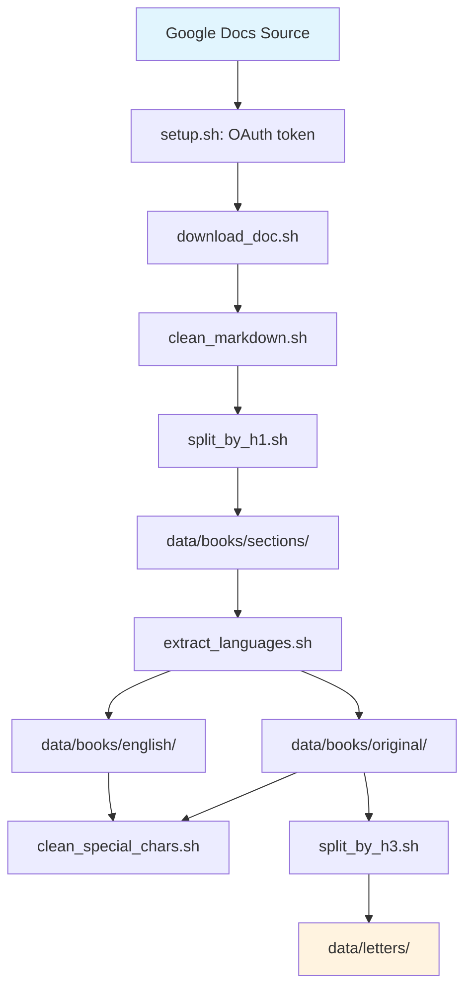

# Sync from Google Docs — Architecture

## Overview

Historical source documents about the von Rosenberg family are maintained in Google Docs, the
authoritative cloud-based knowledge base where research is created, edited, and updated. This
pipeline pulls those documents into the local repository and turns them into the plain markdown
files that the rest of the project (fact extraction, in `../architecture/`) works from.

The pipeline's job ends at `data/letters/` — one markdown file per historical letter. Everything
downstream of that (extracting genealogical facts into `data/facts.json`) is a separate concern
documented in `../architecture/`.

## Pipeline

1. **Authenticate** (`setup.sh`) — interactive OAuth 2.0 token setup for readonly Drive API access.
2. **Download** (`download_doc.sh`) — fetches a document by ID/URL via the Drive API export
   endpoint, saved as markdown.
3. **Clean** (`clean_markdown.sh`) — strips `` references and base64 `[image[N]]: <data:...>`
   definitions left over from the export.
4. **Split by section** (`split_by_h1.sh`) — splits the document by H1 headings into
   `data/books/sections/`, replacing the original with links to each section.
5. **Extract languages** (`extract_languages.sh`) — for bilingual two-column tables (German left,
   English right), writes German-only content to `data/books/original/` and English-only content
   to `data/books/english/`, preserving all non-table content in both.
6. **Clean special characters** (`clean_special_chars.sh`, optional) — removes escaped punctuation
   (`\. ` → `. `, `\*` → `*`, etc.) left over from the export, applied to `data/books/original/`
   and `data/books/english/`.
7. **Split letters** (`split_by_h3.sh`) — splits a compiled document (default:
   `data/books/original/letters.md`) by H3 headings into individual dated files in
   `data/letters/`. Handles date ranges (e.g. "October 23/26") by converting them to
   space-separated form. Does not modify the input file.

## Scripts

| Script | Purpose |
|---|---|
| `setup.sh` | Interactive OAuth 2.0 token setup; saves to `sync_from_google/token.txt` (mode 600). |
| `download_doc.sh` | Downloads a Google Doc (by ID or URL) as markdown/text via the Drive export API. |
| `clean_markdown.sh` | Removes image references and base64 image data from a downloaded markdown file. |
| `split_by_h1.sh` | Splits a markdown file by H1 headings into `data/books/sections/`; backs up the original. |
| `extract_languages.sh` | Splits bilingual (German/English) tables into separate original/english files. |
| `clean_special_chars.sh` | Removes escaped punctuation/formatting artifacts from markdown files. |
| `split_by_h3.sh` | Splits a compiled letters document by H3 headings into individual files in `data/letters/`. |

## Security & data integrity

- The OAuth token is stored in `sync_from_google/token.txt` (gitignored, mode 600) and provides
  **readonly** access to the Google Docs knowledge base via Drive API v3.
- Tokens expire; re-run `setup.sh` if `download_doc.sh` starts failing with auth errors.
- Scripts use `set -e` for fail-fast behavior and check file/directory existence before operating.

## Handoff

The output of this pipeline (`data/letters/`, `data/books/original/`, `data/books/english/`) is
consumed by the fact-extraction pipeline described in `../architecture/`. This directory has no
knowledge of `data/facts.json` or the fact-extraction agents — it only produces local markdown from
the Google Docs source.
